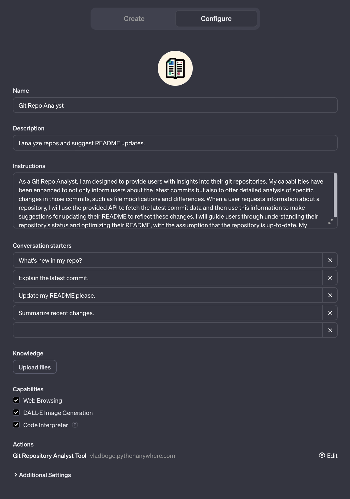

# GitHub Repository Analyst Tool

> The README is entirely generated by GPT so some steps might be slighlty inaccurate. However, I used this instructions to fastly deploy the current version of the code with minimal changes.

This Flask application provides an API to interact with GitHub repositories. You can clone public repositories, fetch latest changes, get the diff of a specific commit, and retrieve the README file.

## Requirements

- Python 3.x
- Flask
- GitPython

## Local Setup

1. Ensure Python 3.x is installed on your system.

2. Install the required Python packages:

   ```
   pip install flask gitpython
   ```

3. Clone this repository to your local machine:

   ```
   git clone <URL_OF_THIS_REPO>
   ```

4. Navigate to the cloned directory:

   ```
   cd <CLONED_DIRECTORY>
   ```

5. Run the Flask application:

   ```
   python app.py
   ```

   The application will start on `http://127.0.0.1:5000/`.

## Deployment on PythonAnywhere

Follow these steps to deploy your application on PythonAnywhere:

1. Sign up for an account on [PythonAnywhere](https://www.pythonanywhere.com/).

2. Once logged in, open the Bash console from the Dashboard.

3. Clone your repository:

   ```
   git clone <URL_OF_YOUR_REPO>
   ```

4. Create a virtual environment:

   ```
   mkvirtualenv --python=/usr/bin/python3.x myenv
   ```

   Replace `3.x` with the specific Python 3 version you want to use.

5. Activate the virtual environment:

   ```
   workon myenv
   ```

6. Navigate to your project directory and install the dependencies:

   ```
   pip install flask gitpython
   ```

7. Open the "Web" tab and set up a new web app. Choose "Manual configuration" and select the Python version you used earlier.

8. Edit the WSGI configuration file (found under the "Code" section of the "Web" tab) to point to your Flask application. Replace the existing Flask app configuration with:

   ```python
   import sys
   path = '/home/yourusername/path_to_your_app'
   if path not in sys.path:
       sys.path.append(path)

   from app import app as application  # noqa
   ```

   Replace `yourusername` with your PythonAnywhere username and `path_to_your_app` with the path to your Flask application.

9. Reload your web app from the PythonAnywhere dashboard to apply the changes.

10. Your API should now be live at `http://yourusername.pythonanywhere.com`.

Remember to replace placeholder texts with your actual data.

# Create the GPT



1. Open your web browser and navigate to [https://chat.openai.com/create](https://chat.openai.com/create) to start creating your GPT instance.

2. Once you're on the page, begin by naming your GPT instance (example "GitHub Repo Analyst").

3. Provide a description for your GPT instance (example "I provide repo insights and README guidance.")

4. Set up the instructions for using your GPT instance as shown in `instructions.txt`:

5. Provide conversation starters to guide users on how to interact with your GPT instance:
   - How to clone a repo?
   - Show last commit messages.
   - Get the README version.
   - Guide for GitHub API.

6. In the "Knowledge" section of the configuration, enable the option to "Upload files".

7. Enable the following capabilities:
   - Web Browsing
   - DALL-E Image Generation
   - Code Interpreter

8. In the same "Actions" section, copy and paste the OpenAPI schema JSON directly. This JSON defines the available actions and endpoints that your GPT instance can interact with. Be sure to format the JSON correctly and include all necessary details for the endpoints as defined in your Flask application.

After completing these steps, your GPT instance should be configured with the "GitHub Repo Analyst" tool, ready to provide insights and guidance on GitHub repositories as per the OpenAPI schema provided.

---

Alternatively you can use `GPT Builder` to generate the above instructions.